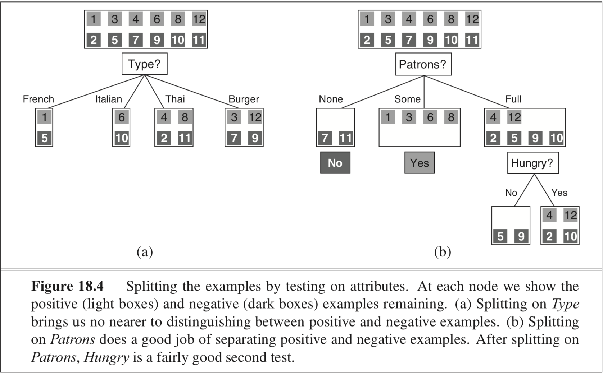
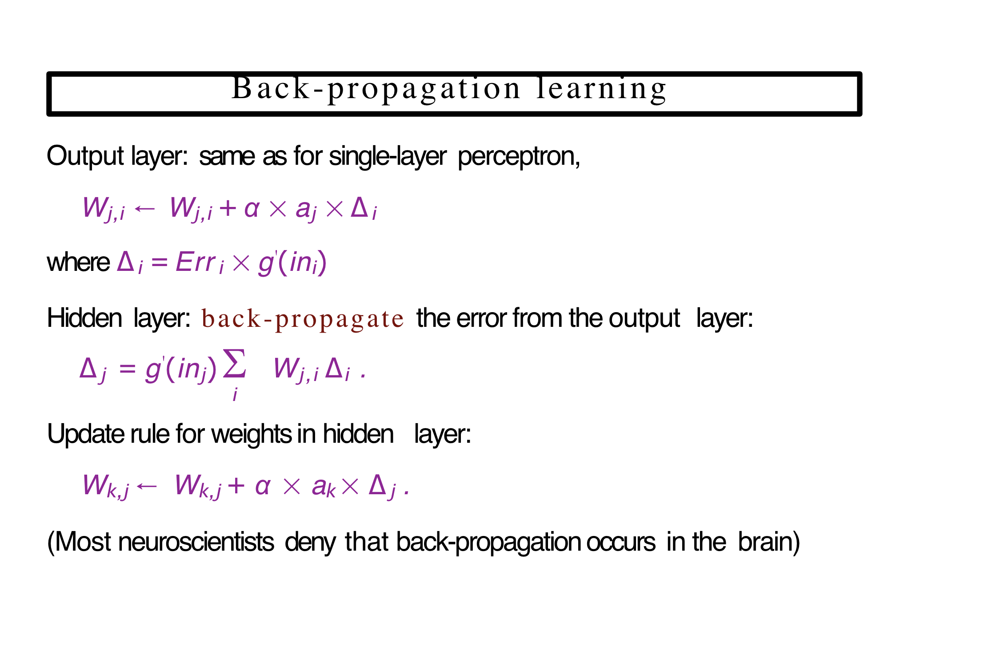

# Chapter 3

## Breath First Search

```python 
from queue import Queue

from utils.Node import letterTree, letterGraph


def breath_first_search(goal, node):
    path_queue = Queue()
    has_seen = set()

    path_queue.put(node)
    while not path_queue.empty():
        next_node =path_queue.get()

        if next_node.value == goal:
            return True

        if next_node.value in has_seen:
            continue

        has_seen.add(next_node.value)
        print(next_node.value)
        if next_node.children is None:
            continue

        for child_node in next_node.children:
            path_queue.put(child_node)

    return False


print('Tree:: {}'.format(breath_first_search('G', letterTree())))

graph = letterGraph()
print('Graph:: {}'.format(breath_first_search('K', graph)))
```

## Depth Limited Search

```python 
from utils.Node import letterTree


def depth_limited_search_r(problem, goal, limit):
    if problem.value == goal:
        return True

    elif problem.depth == limit:
        return 'cutoff'
    else:
        cutoff_occurred = False
        for child in problem.children:
            result = depth_limited_search_r(child, goal, limit)
            if result == 'cutoff':
                cutoff_occurred = True
            elif result is not None:
                return result

        return 'cutoff' if cutoff_occurred else None


def depth_limited_search(head, goal, limit):
    depth = 0
    return depth_limited_search_r(head, goal, limit)


tree = letterTree()

print('{}'.format(depth_limited_search(tree, '4', 2)))
```

## Iterative Deepening Search 

```Python 
import sys

from depth_limited_search import depth_limited_search

from utils.Tree import letterTree


def iterative_deepening_search(tree, goal):

    for depth in range(sys.maxsize):
        result =  depth_limited_search(tree, goal, depth)
        if result is not 'cutoff':
            return result

tree = letterTree()
print('{}'.format(iterative_deepening_search(tree, 'Q')))
```

## Greedy Best First

```python 
from utils.Graph import mapGraphWithCost
from utils.general import get_city_name, start_line_distances
from utils.priority_queue import priority_queue


def success(stack):
    output = ''
    while len(stack) > 0:
        city = stack.pop()
        output = '{} -> {}'.format(city, output)
    return output


def greedy_best_first(start, goal):
    def queue_structure(node, distance):
        return {'node': node, 'distance': distance}

    frontier = priority_queue('distance')
    path = []
    lookup_table = start_line_distances()
    frontier.enqueue(queue_structure(start, lookup_table[get_city_name(start)]))

    while frontier.size() > 0:
        current_object = frontier.dequeue()
        current = current_object['node']
        city = get_city_name(current)

        path.append(city)

        if city == goal:
            return success(path)

        if not current.is_leaf():
            for child in current.children:
                child['distance'] = lookup_table[city]
                frontier.enqueue(child)

    return 'Failure'


graph = mapGraphWithCost()
path = greedy_best_first(graph, 'Bucharest')
print(path)
```

## Uniform Cost

```python 
from utils.Graph import mapGraphWithCost
from utils.general import get_city_name, calculate_cost
from utils.priority_queue import priority_queue


def success(startNode, goal, dict):
    dictKey = goal
    output = goal

    while dictKey != startNode.value:
        dictKey = dict[dictKey]
        output = '{} -> {}'.format(dictKey, output)

    return output


def uniform_cost_search(start, goal):
    path_cost = 0
    frontier = priority_queue()
    explored = set()
    path = {}

    frontier.enqueue({'node': start, 'distance': 0, 'cost': 0})

    while frontier.size() > 0:

        current_object = frontier.dequeue()
        current = current_object['node']
        path_cost = calculate_cost([path_cost, current_object['distance']])
        city = get_city_name(current)

        if city == goal:
            return success(start, goal, path)

        explored.add(city)
        if not current.is_leaf():
            for child in current.children:
                child_city = get_city_name(child['node'])
                if child not in frontier.queue and child_city not in explored:
                    cost = calculate_cost([path_cost, child['distance']])
                    if cost < child['cost']:
                        child['cost'] = cost
                        path[child_city] = city
                    frontier.enqueue(child)

    return 'failure'


for goal in ['Bucharest', 'Neamt', 'JOSH']:
    path = uniform_cost_search(mapGraphWithCost(), goal)
    print(path)
```

## A* Search 

```python 
from utils.Graph import mapGraphWithCost
from utils.general import get_city_name, start_line_distances, calculate_cost
from utils.priority_queue import priority_queue

def success(startNode, goal, dict):
    dictKey = goal
    output = goal

    while dictKey != startNode.value:
        dictKey = dict[dictKey]
        output = '{} -> {}'.format(dictKey, output)

    return output


def a_star_search(start, goal):
    frontier = priority_queue()
    possiable_moves = {}
    lookup_table = start_line_distances()
    explored = set()
    path_cost = 0
    frontier.enqueue(
     {
        'node': start, 
        'distance': 0, 
        'cost': lookup_table[get_city_name(start)]
     }
    )

    while frontier.size() > 0:

        current_object = frontier.dequeue()
        current = current_object['node']
        city = get_city_name(current)
        path_cost = calculate_cost(
            [
                path_cost, 
                current_object['distance'], 
                lookup_table[city]
            ]
        )


        if city == goal :
            return success(start,goal, possiable_moves)

        explored.add(city)
        if not current.is_leaf():
            for child in current.children:
                child_city = get_city_name(child['node'])
                if child not in frontier.queue and child_city not in explored:
                    cost = calculate_cost(
                        [
                            path_cost, 
                            child['distance'], 
                            lookup_table[city]
                        ]
                    )
                    if cost < child['cost']:
                        child['cost'] = cost
                        possiable_moves[child_city] = city
                    frontier.enqueue(child)

    return 'Failure'

goal = 'Bucharest'
path = a_star_search(mapGraphWithCost(), goal)
print(path)
```

# Chapter 4 

### Hill Climbing

```python 
from utils.queens import n_sized_board, h

def main():
    size = 8
    board = n_sized_board(size)
    input_board = list(board)
    sort_over = 'h_cost'

    def format(cost, value):
        return {sort_over: cost, 'value': value}

    def sorter(item):
        return item[sort_over]

    should_not_quit = True
    counter = 0
    while should_not_quit :
        board_copy = list(board)
        for i in range(size):
            lowest_h = []

            for j in range(size):
                board_copy[i] = j
                lowest_h.append(format(h(board_copy), j))

            lowest_h.sort(key=sorter)
            board_copy[i] = lowest_h[0]['value']

        curr_h = h(board)
        new_h = h(board_copy)

        if counter > 50 or curr_h < new_h:
            print('Local minimum')
            should_not_quit = False
        elif curr_h < 1:
            should_not_quit = False
        elif new_h < 1:
            board = board_copy
            should_not_quit = False
        else:
            board = board_copy

        if curr_h == new_h:
            counter = counter + 1

    print('board: {}, cost: {}'.format(input_board, h(input_board)))
    print('board: {}, cost: {}'.format(board, h(board)))

while True:
    main()
```


## Genetic Algorithm

### Example 1
```go 
func GeneticAlgorithm(population, Fitness) returns an individual
    while(1)
   	 new_population = empty set
   	 for i = 1 to SIZE(population)
   		 x = Random-Selection(Population, Fitness)
   		 y = Random-Selection(Population, Fitness)
   		 child = Reproduce(x, y)
   		 if (small random probability)
   			 child = Mutute(child)
   		 new_population.Insert(child)
   	 population = new_population
   	 if top fitness member of population > threshold
   		 exit
   	 else if epochs > max_epochs
   		 exit
    end
    return top fitness member of population

func Reproduce(individual x, y) returns individual
    n = Length(x)
    c = rand(1, n)
    return Append(Substring(x, 1, c), Substring(y, c+1, n))
```

### Example 2 

```python 
import random

#
# Global variables
# Setup optimal string and GA input variables.
#

OPTIMAL     = "Hello, World"
DNA_SIZE    = len(OPTIMAL)
POP_SIZE    = 20
GENERATIONS = 5000

#
# Helper functions
# These are used as support, but aren't direct GA-specific functions.
#

def weighted_choice(items):
  """
  Chooses a random element from items, where items is a list of tuples in
  the form (item, weight). weight determines the probability of choosing its
  respective item. Note: this function is borrowed from ActiveState Recipes.
  """
  weight_total = sum((item[1] for item in items))
  n = random.uniform(0, weight_total)
  for item, weight in items:
    if n < weight:
      return item
    n = n - weight
  return item

def random_char():
  """
  Return a random character between ASCII 32 and 126 (i.e. spaces, symbols,
  letters, and digits). All characters returned will be nicely printable.
  """
  return chr(int(random.randrange(32, 126, 1)))

def random_population():
  """
  Return a list of POP_SIZE individuals, each randomly generated via iterating
  DNA_SIZE times to generate a string of random characters with random_char().
  """
  pop = []
  for i in xrange(POP_SIZE):
    dna = ""
    for c in xrange(DNA_SIZE):
      dna += random_char()
    pop.append(dna)
  return pop

#
# GA functions
# These make up the bulk of the actual GA algorithm.
#

def fitness(dna):
  """
  For each gene in the DNA, this function calculates the difference between
  it and the character in the same position in the OPTIMAL string. These values
  are summed and then returned.
  """
  fitness = 0
  for c in xrange(DNA_SIZE):
    fitness += abs(ord(dna[c]) - ord(OPTIMAL[c]))
  return fitness

def mutate(dna):
  """
  For each gene in the DNA, there is a 1/mutation_chance chance that it will be
  switched out with a random character. This ensures diversity in the
  population, and ensures that is difficult to get stuck in local minima.
  """
  dna_out = ""
  mutation_chance = 100
  for c in xrange(DNA_SIZE):
    if int(random.random()*mutation_chance) == 1:
      dna_out += random_char()
    else:
      dna_out += dna[c]
  return dna_out

def crossover(dna1, dna2):
  """
  Slices both dna1 and dna2 into two parts at a random index within their
  length and merges them. Both keep their initial sublist up to the crossover
  index, but their ends are swapped.
  """
  pos = int(random.random()*DNA_SIZE)
  return (dna1[:pos]+dna2[pos:], dna2[:pos]+dna1[pos:])

#
# Main driver
# Generate a population and simulate GENERATIONS generations.
#

if __name__ == "__main__":
  # Generate initial population. This will create a list of POP_SIZE strings,
  # each initialized to a sequence of random characters.
  population = random_population()

  # Simulate all of the generations.
  for generation in xrange(GENERATIONS):
    print "Generation %s... Random sample: '%s'" % (generation, population[0])
    weighted_population = []

    # Add individuals and their respective fitness levels to the weighted
    # population list. This will be used to pull out individuals via certain
    # probabilities during the selection phase. Then, reset the population list
    # so we can repopulate it after selection.
    for individual in population:
      fitness_val = fitness(individual)

      # Generate the (individual,fitness) pair, taking in account whether or
      # not we will accidently divide by zero.
      if fitness_val == 0:
        pair = (individual, 1.0)
      else:
        pair = (individual, 1.0/fitness_val)

      weighted_population.append(pair)

    population = []

    # Select two random individuals, based on their fitness probabilites, cross
    # their genes over at a random point, mutate them, and add them back to the
    # population for the next iteration.
    for _ in xrange(POP_SIZE/2):
      # Selection
      ind1 = weighted_choice(weighted_population)
      ind2 = weighted_choice(weighted_population)

      # Crossover
      ind1, ind2 = crossover(ind1, ind2)

      # Mutate and add back into the population.
      population.append(mutate(ind1))
      population.append(mutate(ind2))

  # Display the highest-ranked string after all generations have been iterated
  # over. This will be the closest string to the OPTIMAL string, meaning it
  # will have the smallest fitness value. Finally, exit the program.
  fittest_string = population[0]
  minimum_fitness = fitness(population[0])

  for individual in population:
    ind_fitness = fitness(individual)
    if ind_fitness <= minimum_fitness:
      fittest_string = individual
      minimum_fitness = ind_fitness

  print "Fittest String: %s" % fittest_string
  exit(0)
```

# Chapter 5

## alpha_beta_pruning

```python
 from utils.Node import infinity
from utils.Tree import tree_for_adv_search


def alpha_beta_pruning(tree):
    v = max_value(tree, -infinity, infinity)

    return v


def max_value(node, alpha, beta):
    if node.is_leaf():
        return node.value

    v = - infinity

    for child in node.children:
        v = max(v, min_value(child, alpha, beta))

        if v >= beta:
            return v
        alpha = max(alpha, v)


    node.value = v
    return v


def min_value(node, alpha, beta):
    if node.is_leaf():
        return node.value

    v = infinity

    for child in node.children:
        v = min(v, max_value(child, alpha, beta))

        if v <= alpha:
            return v

        beta = min(beta, v)

    node.value = v

    return v


tree = tree_for_adv_search()
output = alpha_beta_pruning(tree)

print('the output of this alpha beta pruning is {}'.format(output))<Paste>
```

## Mini Max

```python

from utils.Node import infinity
from utils.Tree import tree_for_adv_search


def mini_max(tree):
    out = max_value(tree)
    return out


def min_value(node):
    if node.is_leaf():
        return node.value

    v = infinity

    for child in node.children:
        v = min(v, max_value(child))

    node.value = v

    return v


def max_value(node):
    if node.is_leaf():
        return node.value

    v = -infinity

    for child in node.children:
        v = max(v, min_value(child))

    node.value = v

    return v

tree = tree_for_adv_search()
output = mini_max(tree)

print(output)
```

# Chapter 6 

## Backtracking 

```python 
from chapters.ch_6_constraint_satisfaction_problems.general import austria_graph


def recursive_backtracking(node, eval_, has_visited, output_set):  # Generic algorithm
    curr_node = node['node']
    node_children = curr_node.children
    node_name = curr_node.value

    value = eval_(node)  # passed in function that makes the decision for our backtracking algorithm

    if value is False:
        return

    has_visited.add(node_name)
    output_set.append(tuple((node_name, value)))

    if len(has_visited) == 6:
        return output_set

    for child in node_children:
        if child['node'].value not in has_visited:
            return recursive_backtracking(child, eval_, has_visited, output_set)

    has_visited.remove(node_name)
    return False


def backtracking_search(csp, eval_):
    has_visited = set()
    output_set = []
    return recursive_backtracking(csp, eval_, has_visited, output_set)


def unused_colors(node):  # evaluate function
    is_unused = {'red', 'blue', 'green'}

    if node['color'] is not None:
        is_unused.remove(node['color'])

    for child in node['node'].children:

        child_color = child['color']

        if child_color is None:
            continue

        if is_unused is None or child_color not in is_unused:
            return False

        is_unused.remove(child_color)

    if is_unused is None:
        return False

    node['color'] = next(iter(is_unused))

    return node['color']


head_node = austria_graph()  # map
output = backtracking_search(
    head_node,
    unused_colors,
)

print(output)
```


## Arc 

* TODO 

---

## Queens.py

```python 
import random

def queen_placement(size):
    return random.randint(0, size - 1)


def n_sized_board(size):
    board = []
    for n in range(size):
        board.append(queen_placement(size))

    return board


def is_attacking(r1, c1, r2, c2):
    if r1 == r2:
        return True
    if c1 == c2:
        return True

    diagonal = (c2 - c1) / (r2 - r1)

    if abs(diagonal) == 1:
        return True


def h(board):
    size = len(board)
    attacking = 0

    for i in range(size):
        for j in range(size):
            if is_attacking(board[j], j, board[i], i):
                attacking = attacking + 1
    attacking = attacking - size  # remove self attacks
    attacking = attacking / 2  # counting for overlinks

    return attacking
```


# 8 Piece Puzzle

* TODO 

---

## Wampous world

* TODO 


## Chapter 13

### Decision theory = probability theory + utility theory

- Use __utility theory__ to represent and reason with preferences

### Product Rule

P( a ^ b ) = P( A | B )P( B )

.png)


# Chapter 14


## Inference by Enumeration
Given, the following: 

P( B, E, A, J, M ) = P( J | A )P( M | A )P( A | E, B )P( B )P( E )


Find P( J | A )? 

$$=\sum_{B}^{\infty}\sum_{M}^{\infty}\sum_{E}^{\infty} \frac{P(b,e,j,m)}{P(a)}$$

## Evaluation Tree


### Code

```go
// BayesNet variable. Assume variable assignments are enumerated ints
struct Variable {
    Id int // Unique variable identity
    Value int // Enumerated value
    Domain []int
    Neighbors []*Variable
    CPT map[string][]float // Map a string to an array of float values
}

// Bayesian Network, Vars a list of variables in topological order
struct BayesNet {
    Vars []Variable
}

// EnumerationAsk returns a distribution over values of X (int encoding)
func EnumerationAsk(X Variable, e []Variable, net BayesNet) map[int]float {
    Q := make(map[int]float)
    for x := X.Domain {
   	 Xt = X
   	 Xt.Value = x
   	 et = append(e, Xt)
   	 Q[x] = EnumerateAll(net.Vars, et)
    }
    return Normalize(Q)
}

func EnumerateAll(netVars []Variable, e []Variable) float {
    if len(vars) <= 0 {
   	 return 1.o
    }
    Y = netVars[0]
    if ismember(Y, e) {
   	 return Y.PParents(ey)*EnumerateAll(netVars[1:], e)
    } else {
   	 var sum float64
   	 for y := range Y.Dom {
   		 Yt = Y
   		 Yt.Value = y
   		 ey = append(e, Yt)
 YDist := Y.ProbParents(ey)
   		 sum += YDist[y]*EnumerateAll(netVars[1:], ey)
   	 }
   	 return sum
    }
}

// Computes the conditional probability given parents’ assignment in
//  the variable assignment argument
func (var Variable) ProbParents(vAssign []Variable) float {
// Get parent assignment in string form
var parVal string
for i, v := range var.Parents {
// Append variable assignment to parVal. find() returns the
//  first element whose contents correspond to v.
parVal = append(parVal, toString(vAssign.find(v).Value))
}
return var.CPT[parVal]
}

```

## Decision Tree

https://github.com/random-forests/tutorials/blob/master/decision_tree.ipynb
https://github.com/random-forests/tutorials/blob/master/decision_tree.py


### Example 1 - Utils 

```python 
identity = lambda x: x

def argmax_random_tie(seq, key=identity):
    """Return an element with highest fn(seq[i]) score; break ties at random."""
    return max(shuffled(seq), key=key)

def shuffled(iterable):
    """Randomly shuffle a copy of iterable."""
    items = list(iterable)
    random.shuffle(items)
    return items


class DecisionFork:
    """A fork of a decision tree holds an attribute to test, and a dict
    of branches, one for each of the attribute's values."""

    def __init__(self, attr, attrname=None, default_child=None, branches=None):
        """Initialize by saying what attribute this node tests."""
        self.attr = attr
        self.attrname = attrname or attr
        self.default_child = default_child
        self.branches = branches or {}

    def __call__(self, example):
        """Given an example, classify it using the attribute and the branches."""
        attrvalue = example[self.attr]
        if attrvalue in self.branches:
            return self.branches[attrvalue](example)
        else:
            # return default class when attribute is unknown
            return self.default_child(example)

    def add(self, val, subtree):
        """Add a branch.  If self.attr = val, go to the given subtree."""
        self.branches[val] = subtree

    def display(self, indent=0):
        name = self.attrname
        print('Test', name)
        for (val, subtree) in self.branches.items():
            print(' ' * 4 * indent, name, '=', val, '==>', end=' ')
            subtree.display(indent + 1)
        print()   # newline

    def __repr__(self):
        return ('DecisionFork({0!r}, {1!r}, {2!r})'
                .format(self.attr, self.attrname, self.branches))

class DecisionLeaf:
    """A leaf of a decision tree holds just a result."""

    def __init__(self, result):
        self.result = result

    def __call__(self, example):
        return self.result

    def display(self, indent=0):
        print('RESULT =', self.result)

    def __repr__(self):
        return repr(self.result)
```

### Example 1 - Main Code


```python 
def DecisionTreeLearner(dataset):
    target, values = dataset.target, dataset.values

    def decision_tree_learning(examples, attrs, parent_examples=()):
        if len(examples) == 0:
            return plurality_value(parent_examples)
        elif all_same_class(examples):
            return DecisionLeaf(examples[0][target])
        elif len(attrs) == 0:
            return plurality_value(examples)
        else:
            A = choose_attribute(attrs, examples)
            tree = DecisionFork(A, dataset.attrnames[A], plurality_value(examples))
            for (v_k, exs) in split_by(A, examples):
                subtree = decision_tree_learning(
                    exs, removeall(A, attrs), examples)
                tree.add(v_k, subtree)
            return tree

    def plurality_value(examples):
        """Return the most popular target value for this set of examples.
        (If target is binary, this is the majority; otherwise plurality.)"""
        popular = argmax_random_tie(values[target],
                                    key=lambda v: count(target, v, examples))
        return DecisionLeaf(popular)

    def count(attr, val, examples):
        """Count the number of examples that have example[attr] = val."""
        return sum(e[attr] == val for e in examples)

    def all_same_class(examples):
        """Are all these examples in the same target class?"""
        class0 = examples[0][target]
        return all(e[target] == class0 for e in examples)

    def choose_attribute(attrs, examples):
        """Choose the attribute with the highest information gain."""
        return argmax_random_tie(attrs,
                                 key=lambda a: information_gain(a, examples))

    def information_gain(attr, examples): # Entropy
        """Return the expected reduction in entropy from splitting by attr."""
        def B(examples):
            return information_content([count(target, v, examples)
                                        for v in values[target]])
        N = len(examples)
        remainder = sum((len(examples_i)/N) * B(examples_i)
                        for (v, examples_i) in split_by(attr, examples))
        return B(examples) - remainder

    def split_by(attr, examples):
        """Return a list of (val, examples) pairs for each val of attr."""
        return [(v, [e for e in examples if e[attr] == v])
                for v in values[attr]]

    return decision_tree_learning(dataset.examples, dataset.inputs)
```

# Chapter 18/20 Neural Networks 

## Entropy 

Entropy is a  measure of the uncertainty of a random variable; acquisition of information corresponds to a reduction.

* coin is equally likely to come up heads or tails (0, 1) and counts as "1 bit" of entropy.
* four-sided die has "2 bits" of entropy because it takes two bits to describe one of four equally probable choices.

### Entropy equation

$$H(V)=\sum_{k} P(V_k)*log_2(\frac{1}{P(V_k)}) = -\sum_{k} P(V_k)*log_2(P(V_k))$$

* The entropy of a random variable $V$ is with values $V_k$, each with probability $P(V_k)$

### Entropy of a Boolean
$$ B(q)= -(q*log_2(q) + (1 - q)*log_2(1-q) )$$

### Remainder(A)

$Remainder(A)=\sum_{k}^{d}log_2(\frac{p_k + n_k}{p + n})*B(\frac{p_k}{p_k + n_k})$

* $p$ positive cases 
* $n$ negative cases 
* $p_k$,$n_k$ per feature



### Information Gain

$Gain(A)= B(\frac{p}{p+n}) - Remainder(A)$

### The Codes

```python
def information_gain(attr, examples): # Entropy
    """Return the expected reduction in entropy from splitting by attr."""
    def B(examples):
        return information_content([count(target, v, examples)
                                    for v in values[target]])
    N = len(examples)
    remainder = sum((len(examples_i)/N) * B(examples_i)
                    for (v, examples_i) in split_by(attr, examples))
    return B(examples) - remainder
```




### Utils

```python
def sigmoid_derivative(value):
    return value * (1 - value)

def sigmoid(x):
    """Return activation value of x with sigmoid function"""
    return 1 / (1 + math.exp(-x))

def relu_derivative(value):
	if value > 0:
		return 1
	else:
		return 0

def elu(x, alpha=0.01):
	if x > 0:
		return x
	else:
		return alpha * (math.exp(x) - 1)
		
def elu_derivative(value, alpha = 0.01):
	if value > 0:
		return 1
	else:
		return alpha * math.exp(value)

def tanh(x):
	return np.tanh(x)

def tanh_derivative(value):
	return (1 - (value ** 2))

def leaky_relu(x, alpha = 0.01):
	if x > 0:
		return x
	else:
		return alpha * x

def leaky_relu_derivative(value, alpha=0.01):
	if value > 0:
		return 1
	else:
		return alpha

def relu(x):
	return max(0, x)
	
def relu_derivative(value):
	if value > 0:
		return 1
	else:
		return 0
```

## Network 

```python
"""
network.py
~~~~~~~~~~
A module to implement the stochastic gradient descent learning
algorithm for a feedforward neural network.  Gradients are calculated
using backpropagation.  Note that I have focused on making the code
simple, easily readable, and easily modifiable.  It is not optimized,
and omits many desirable features.
"""

#### Libraries
# Standard library
import random

# Third-party libraries
import numpy as np

class Network(object):

    def __init__(self, sizes):
        """The list ``sizes`` contains the number of neurons in the
        respective layers of the network.  For example, if the list
        was [2, 3, 1] then it would be a three-layer network, with the
        first layer containing 2 neurons, the second layer 3 neurons,
        and the third layer 1 neuron.  The biases and weights for the
        network are initialized randomly, using a Gaussian
        distribution with mean 0, and variance 1.  Note that the first
        layer is assumed to be an input layer, and by convention we
        won't set any biases for those neurons, since biases are only
        ever used in computing the outputs from later layers."""
        self.num_layers = len(sizes)
        self.sizes = sizes
        self.biases = [np.random.randn(y, 1) for y in sizes[1:]]
        self.weights = [np.random.randn(y, x)
                        for x, y in zip(sizes[:-1], sizes[1:])]

    def feedforward(self, a):
        """Return the output of the network if ``a`` is input."""
        for b, w in zip(self.biases, self.weights):
            a = sigmoid(np.dot(w, a)+b)
        return a

    def SGD(self, training_data, epochs, mini_batch_size, eta,
            test_data=None):
        """Train the neural network using mini-batch stochastic
        gradient descent.  The ``training_data`` is a list of tuples
        ``(x, y)`` representing the training inputs and the desired
        outputs.  The other non-optional parameters are
        self-explanatory.  If ``test_data`` is provided then the
        network will be evaluated against the test data after each
        epoch, and partial progress printed out.  This is useful for
        tracking progress, but slows things down substantially."""
        if test_data: n_test = len(test_data)
        n = len(training_data)
        for j in xrange(epochs):
            random.shuffle(training_data)
            mini_batches = [
                training_data[k:k+mini_batch_size]
                for k in xrange(0, n, mini_batch_size)]
            for mini_batch in mini_batches:
                self.update_mini_batch(mini_batch, eta)
            if test_data:
                print "Epoch {0}: {1} / {2}".format(
                    j, self.evaluate(test_data), n_test)
            else:
                print "Epoch {0} complete".format(j)

    def update_mini_batch(self, mini_batch, eta):
        """Update the network's weights and biases by applying
        gradient descent using backpropagation to a single mini batch.
        The ``mini_batch`` is a list of tuples ``(x, y)``, and ``eta``
        is the learning rate."""
        nabla_b = [np.zeros(b.shape) for b in self.biases]
        nabla_w = [np.zeros(w.shape) for w in self.weights]
        for x, y in mini_batch:
            delta_nabla_b, delta_nabla_w = self.backprop(x, y)
            nabla_b = [nb+dnb for nb, dnb in zip(nabla_b, delta_nabla_b)]
            nabla_w = [nw+dnw for nw, dnw in zip(nabla_w, delta_nabla_w)]
        self.weights = [w-(eta/len(mini_batch))*nw
                        for w, nw in zip(self.weights, nabla_w)]
        self.biases = [b-(eta/len(mini_batch))*nb
                       for b, nb in zip(self.biases, nabla_b)]

    def backprop(self, x, y):
        """Return a tuple ``(nabla_b, nabla_w)`` representing the
        gradient for the cost function C_x.  ``nabla_b`` and
        ``nabla_w`` are layer-by-layer lists of numpy arrays, similar
        to ``self.biases`` and ``self.weights``."""
        nabla_b = [np.zeros(b.shape) for b in self.biases]
        nabla_w = [np.zeros(w.shape) for w in self.weights]
        # feedforward
        activation = x
        activations = [x] # list to store all the activations, layer by layer
        zs = [] # list to store all the z vectors, layer by layer
        for b, w in zip(self.biases, self.weights):
            z = np.dot(w, activation)+b
            zs.append(z)
            activation = sigmoid(z)
            activations.append(activation)
        # backward pass
        delta = self.cost_derivative(activations[-1], y) * \
            sigmoid_prime(zs[-1])
        nabla_b[-1] = delta
        nabla_w[-1] = np.dot(delta, activations[-2].transpose())
        # Note that the variable l in the loop below is used a little
        # differently to the notation in Chapter 2 of the book.  Here,
        # l = 1 means the last layer of neurons, l = 2 is the
        # second-last layer, and so on.  It's a renumbering of the
        # scheme in the book, used here to take advantage of the fact
        # that Python can use negative indices in lists.
        for l in xrange(2, self.num_layers):
            z = zs[-l]
            sp = sigmoid_prime(z)
            delta = np.dot(self.weights[-l+1].transpose(), delta) * sp
            nabla_b[-l] = delta
            nabla_w[-l] = np.dot(delta, activations[-l-1].transpose())
        return (nabla_b, nabla_w)

    def evaluate(self, test_data):
        """Return the number of test inputs for which the neural
        network outputs the correct result. Note that the neural
        network's output is assumed to be the index of whichever
        neuron in the final layer has the highest activation."""
        test_results = [(np.argmax(self.feedforward(x)), y)
                        for (x, y) in test_data]
        return sum(int(x == y) for (x, y) in test_results)

    def cost_derivative(self, output_activations, y):
        """Return the vector of partial derivatives \partial C_x /
        \partial a for the output activations."""
        return (output_activations-y)

#### Miscellaneous functions
def sigmoid(z):
    """The sigmoid function."""
    return 1.0/(1.0+np.exp(-z))

def sigmoid_prime(z):
    """Derivative of the sigmoid function."""
    return sigmoid(z)*(1-sigmoid(z))


def main():
     net = network.Network([
     784, # input layer
     30, # hidden layer
     10  # Output layer
     ])
     net.SGD(
     training_data, 
     30, # epochs
     10, # Batch size 
     100.0, # learning rate (eta)
     test_data=test_data
     )
```

https://www.bogotobogo.com/python/python_Neural_Networks_Backpropagation_for_XOR_using_one_hidden_layer.php
https://www.bogotobogo.com/python/files/NeuralNetworks/nn3.py

## Chapter 20

* TODO 

### Naive Bayes
