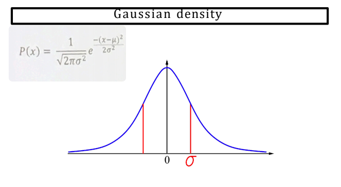

# 8 Piece Puzzle

* TODO 

## Arc 

* TODO 

## Wampous world

* TODO 


## Chapter 13

### Decision theory = probability theory + utility theory

- Use __utility theory__ to represent and reason with preferences

### Product Rule

P( a ^ b ) = P( A | B )P( B )

.png)


# Chapter 14


## Inference by Enumeration
Given, the following: 

P( B, E, A, J, M ) = P( J | A )P( M | A )P( A | E, B )P( B )P( E )


Find P( J | A )? 

$$=\sum_{B}^{\infty}\sum_{M}^{\infty}\sum_{E}^{\infty} \frac{P(b,e,j,m)}{P(a)}$$

## Evaluation Tree


# Chapter 14 - Decision Trees
https://github.com/random-forests/tutorials/blob/master/decision_tree.ipynb
https://github.com/random-forests/tutorials/blob/master/decision_tree.py


## Decision Tree

<!---->


### Example 1 - Utils 

```python 
identity = lambda x: x

def argmax_random_tie(seq, key=identity):
    """Return an element with highest fn(seq[i]) score; break ties at random."""
    return max(shuffled(seq), key=key)

def shuffled(iterable):
    """Randomly shuffle a copy of iterable."""
    items = list(iterable)
    random.shuffle(items)
    return items

```

### Example 1 - Main Code


```python 
def DecisionTreeLearner(dataset):
    target, values = dataset.target, dataset.values

    def decision_tree_learning(examples, attrs, parent_examples=()):
        if len(examples) == 0:
            return plurality_value(parent_examples)
        elif all_same_class(examples):
            return DecisionLeaf(examples[0][target])
        elif len(attrs) == 0:
            return plurality_value(examples)
        else:
            A = choose_attribute(attrs, examples)
            tree = DecisionFork(A, dataset.attrnames[A], plurality_value(examples))
            for (v_k, exs) in split_by(A, examples):
                subtree = decision_tree_learning(
                    exs, removeall(A, attrs), examples)
                tree.add(v_k, subtree)
            return tree

    def plurality_value(examples):
        """Return the most popular target value for this set of examples.
        (If target is binary, this is the majority; otherwise plurality.)"""
        popular = argmax_random_tie(values[target],
                                    key=lambda v: count(target, v, examples))
        return DecisionLeaf(popular)

    def count(attr, val, examples):
        """Count the number of examples that have example[attr] = val."""
        return sum(e[attr] == val for e in examples)

    def all_same_class(examples):
        """Are all these examples in the same target class?"""
        class0 = examples[0][target]
        return all(e[target] == class0 for e in examples)

    def choose_attribute(attrs, examples):
        """Choose the attribute with the highest information gain."""
        return argmax_random_tie(attrs,
                                 key=lambda a: information_gain(a, examples))

    def information_gain(attr, examples): # Entropy
        """Return the expected reduction in entropy from splitting by attr."""
        def B(examples):
            return information_content([count(target, v, examples)
                                        for v in values[target]])
        N = len(examples)
        remainder = sum((len(examples_i)/N) * B(examples_i)
                        for (v, examples_i) in split_by(attr, examples))
        return B(examples) - remainder

    def split_by(attr, examples):
        """Return a list of (val, examples) pairs for each val of attr."""
        return [(v, [e for e in examples if e[attr] == v])
                for v in values[attr]]

    return decision_tree_learning(dataset.examples, dataset.inputs)
```


<!--# Chapter 16-->

<!---->
<!---->

# Chapter 18/20 Neural Networks 

## Entropy 

```python
    def information_gain(attr, examples): # Entropy
        """Return the expected reduction in entropy from splitting by attr."""
        def B(examples):
            return information_content([count(target, v, examples)
                                        for v in values[target]])
        N = len(examples)
        remainder = sum((len(examples_i)/N) * B(examples_i)
                        for (v, examples_i) in split_by(attr, examples))
        return B(examples) - remainder
```





## Network 

```python
"""
network.py
~~~~~~~~~~
A module to implement the stochastic gradient descent learning
algorithm for a feedforward neural network.  Gradients are calculated
using backpropagation.  Note that I have focused on making the code
simple, easily readable, and easily modifiable.  It is not optimized,
and omits many desirable features.
"""

#### Libraries
# Standard library
import random

# Third-party libraries
import numpy as np

class Network(object):

    def __init__(self, sizes):
        """The list ``sizes`` contains the number of neurons in the
        respective layers of the network.  For example, if the list
        was [2, 3, 1] then it would be a three-layer network, with the
        first layer containing 2 neurons, the second layer 3 neurons,
        and the third layer 1 neuron.  The biases and weights for the
        network are initialized randomly, using a Gaussian
        distribution with mean 0, and variance 1.  Note that the first
        layer is assumed to be an input layer, and by convention we
        won't set any biases for those neurons, since biases are only
        ever used in computing the outputs from later layers."""
        self.num_layers = len(sizes)
        self.sizes = sizes
        self.biases = [np.random.randn(y, 1) for y in sizes[1:]]
        self.weights = [np.random.randn(y, x)
                        for x, y in zip(sizes[:-1], sizes[1:])]

    def feedforward(self, a):
        """Return the output of the network if ``a`` is input."""
        for b, w in zip(self.biases, self.weights):
            a = sigmoid(np.dot(w, a)+b)
        return a

    def SGD(self, training_data, epochs, mini_batch_size, eta,
            test_data=None):
        """Train the neural network using mini-batch stochastic
        gradient descent.  The ``training_data`` is a list of tuples
        ``(x, y)`` representing the training inputs and the desired
        outputs.  The other non-optional parameters are
        self-explanatory.  If ``test_data`` is provided then the
        network will be evaluated against the test data after each
        epoch, and partial progress printed out.  This is useful for
        tracking progress, but slows things down substantially."""
        if test_data: n_test = len(test_data)
        n = len(training_data)
        for j in xrange(epochs):
            random.shuffle(training_data)
            mini_batches = [
                training_data[k:k+mini_batch_size]
                for k in xrange(0, n, mini_batch_size)]
            for mini_batch in mini_batches:
                self.update_mini_batch(mini_batch, eta)
            if test_data:
                print "Epoch {0}: {1} / {2}".format(
                    j, self.evaluate(test_data), n_test)
            else:
                print "Epoch {0} complete".format(j)

    def update_mini_batch(self, mini_batch, eta):
        """Update the network's weights and biases by applying
        gradient descent using backpropagation to a single mini batch.
        The ``mini_batch`` is a list of tuples ``(x, y)``, and ``eta``
        is the learning rate."""
        nabla_b = [np.zeros(b.shape) for b in self.biases]
        nabla_w = [np.zeros(w.shape) for w in self.weights]
        for x, y in mini_batch:
            delta_nabla_b, delta_nabla_w = self.backprop(x, y)
            nabla_b = [nb+dnb for nb, dnb in zip(nabla_b, delta_nabla_b)]
            nabla_w = [nw+dnw for nw, dnw in zip(nabla_w, delta_nabla_w)]
        self.weights = [w-(eta/len(mini_batch))*nw
                        for w, nw in zip(self.weights, nabla_w)]
        self.biases = [b-(eta/len(mini_batch))*nb
                       for b, nb in zip(self.biases, nabla_b)]

    def backprop(self, x, y):
        """Return a tuple ``(nabla_b, nabla_w)`` representing the
        gradient for the cost function C_x.  ``nabla_b`` and
        ``nabla_w`` are layer-by-layer lists of numpy arrays, similar
        to ``self.biases`` and ``self.weights``."""
        nabla_b = [np.zeros(b.shape) for b in self.biases]
        nabla_w = [np.zeros(w.shape) for w in self.weights]
        # feedforward
        activation = x
        activations = [x] # list to store all the activations, layer by layer
        zs = [] # list to store all the z vectors, layer by layer
        for b, w in zip(self.biases, self.weights):
            z = np.dot(w, activation)+b
            zs.append(z)
            activation = sigmoid(z)
            activations.append(activation)
        # backward pass
        delta = self.cost_derivative(activations[-1], y) * \
            sigmoid_prime(zs[-1])
        nabla_b[-1] = delta
        nabla_w[-1] = np.dot(delta, activations[-2].transpose())
        # Note that the variable l in the loop below is used a little
        # differently to the notation in Chapter 2 of the book.  Here,
        # l = 1 means the last layer of neurons, l = 2 is the
        # second-last layer, and so on.  It's a renumbering of the
        # scheme in the book, used here to take advantage of the fact
        # that Python can use negative indices in lists.
        for l in xrange(2, self.num_layers):
            z = zs[-l]
            sp = sigmoid_prime(z)
            delta = np.dot(self.weights[-l+1].transpose(), delta) * sp
            nabla_b[-l] = delta
            nabla_w[-l] = np.dot(delta, activations[-l-1].transpose())
        return (nabla_b, nabla_w)

    def evaluate(self, test_data):
        """Return the number of test inputs for which the neural
        network outputs the correct result. Note that the neural
        network's output is assumed to be the index of whichever
        neuron in the final layer has the highest activation."""
        test_results = [(np.argmax(self.feedforward(x)), y)
                        for (x, y) in test_data]
        return sum(int(x == y) for (x, y) in test_results)

    def cost_derivative(self, output_activations, y):
        """Return the vector of partial derivatives \partial C_x /
        \partial a for the output activations."""
        return (output_activations-y)

#### Miscellaneous functions
def sigmoid(z):
    """The sigmoid function."""
    return 1.0/(1.0+np.exp(-z))

def sigmoid_prime(z):
    """Derivative of the sigmoid function."""
    return sigmoid(z)*(1-sigmoid(z))


def main():
     net = network.Network([
     784, # input layer
     30, # hidden layer
     10  # Output layer
     ])
     net.SGD(
     training_data, 
     30, # epochs
     10, # Batch size 
     100.0, # learning rate (eta)
     test_data=test_data
     )
```

https://www.bogotobogo.com/python/python_Neural_Networks_Backpropagation_for_XOR_using_one_hidden_layer.php
https://www.bogotobogo.com/python/files/NeuralNetworks/nn3.py

